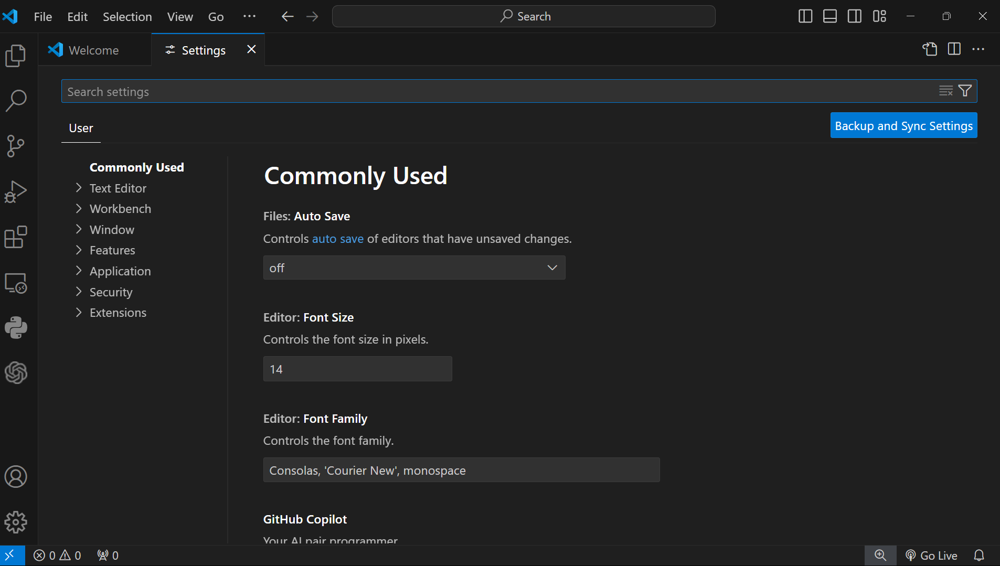

## Answers
1. Installation of VS Code:
   - To download and install Visual Studio Code on Windows 11 operating system, I follow these steps:
     1. I Open a web browser and navigate to the official [Visual Studio Code website](https://code.visualstudio.com/).
     2. Click on the "Download for Windows" button to download the installer.
     3. Once the installer is downloaded, I double-click on the downloaded file to start the installation process.
     4. Following the on-screen instructions in the installer to complete the installation.
     5. After the installation is complete, I launch Visual Studio Code by double-clicking on the shortcut created on the desktop or by searching for "Visual Studio Code" in the Start menu.
   - Prerequisites:
     - Windows 11 operating system.
     - Internet connection to download the installer.
     
2. First-time Setup:
    - After installing Visual Studio Code, some initial configurations and settings can be adjusted for an optimal coding environment:
      - Install essential extensions eg. python extension for visual studio code for python development.
      
      - Customize settings such as font size, theme, and keybindings.
      - Set up Git integration for version control using the following commands.
      ```bash
        git config --global user.name "Your Name"
        git config --global user.email "
      
      ```
      
      - Configure debugging settings.
      - Adjust editor preferences like tab size, line height, and word wrap.
      - Familiarize yourself with keyboard shortcuts for common tasks and easier navigation through the program software.
      
3. User Interface Overview:
    - The main components of the Visual Studio Code user interface are:
      - Activity Bar: Contains icons for different views like Explorer, Search, Source Control, and Extensions.
      - Side Bar: Displays the file explorer, search functionality, and source control information.
      - Editor Group: The main area where code is written and edited.
      - Status Bar: Shows information about the current file, line endings, and language mode.
      - picture of the interface
      - 

4. Command Palette:
    - The Command Palette in Visual Studio Code is a powerful tool that allows users to access various commands and
    - features through a search interface. It can be accessed by pressing `Ctrl+Shift+P` or `Cmd+Shift+P` on macOS.
    - Some common tasks that can be performed using the Command Palette include:
      - Opening and switching between files.
      - Running tasks and scripts.
      - Installing and managing extensions.
      - Changing settings and preferences.
      - Searching for symbols and references.
      - Running Git commands.
      - picture of the command palette
      - 

5. Extensions in VS Code:
    - Extensions in Visual Studio Code are add-ons that enhance the functionality of the editor by providing additional
   features and tools. Users can find, install, and manage extensions through the Extensions view in the Activity Bar.
   Some essential extensions for web development include:
      - Live Server: Launches a local development server with live reload capability.
      - Prettier: Code formatter that helps maintain consistent code style.
      - ESLint: JavaScript linter for identifying and fixing code errors.
      - Debugger for Chrome: Allows debugging JavaScript code in the Chrome browser.
      - GitLens: Provides enhanced Git integration with features like blame information and commit history.
      - picture of the extensions
      - 

6. Integrated Terminal:
    - The integrated terminal in Visual Studio Code allows users to run command-line tools and scripts without
   leaving the editor. It can be opened by pressing `Ctrl+`` or `Cmd+`` on macOS. 
   Some advantages of using the integrated terminal compared to an external terminal include:
      - Seamless integration with the editor for a unified coding experience.
      - Easy access to terminal commands without switching between applications.
      - Ability to split the terminal into multiple panes for multitasking.
      - picture of the terminal
      - 

7. File and Folder Management:
    - Users can create, open, and manage files and folders in Visual Studio Code through the Explorer view in the Side Bar.
   To navigate between different files and directories efficiently, users can:
      - Use the file explorer to browse and open files.
      - Use the Go to File command (`Ctrl+P` or `Cmd+P` on macOS) to quickly search for and open files by name.
      - Use the Go to Symbol command (`Ctrl+Shift+O` or `Cmd+Shift+O` on macOS) to navigate to symbols within a file.
      - Use the breadcrumbs feature to navigate through the file hierarchy.
      

8. Settings and Preferences:
    - Users can find and customize settings in Visual Studio Code by accessing the Settings view through the gear icon in the
   Activity Bar or by pressing `Ctrl+,` or `Cmd+,` on macOS. Some examples of settings that can be customized include:
      - Theme: Change the color theme of the editor.
      - Font size: Adjust the size of the text in the editor.
      - Keybindings: Customize keyboard shortcuts for various commands.
      - picture of the settings
      - 

9. Debugging in VS Code:
    - To set up and start debugging a simple program in Visual Studio Code, users can follow these steps:
      - Open the file containing the code to be debugged.
      - Set breakpoints by clicking in the gutter next to the line numbers.
      - Open the Run and Debug view in the Side Bar and click on the green play button to start debugging.
      - Use the debugging toolbar to step through the code, inspect variables, and control the debugging session.
      - Some key debugging features available in Visual Studio Code include:
        - Variable inspection: View the values of variables at different points in the code.
        - Call stack navigation: Navigate through the call stack to understand the flow of the program.
        - Watch expressions: Monitor the values of specific expressions during debugging.
        

10. Using Source Control:
    - Users can integrate Git with Visual Studio Code for version control by following these steps:
      - Initialize a Git repository in the project folder using the `git init` command.
      - Stage changes to be committed using the Source Control view in the Side Bar.
      - Commit changes with a commit message to save them to the repository.
      - Push changes to a remote repository like GitHub using the push command.
      - Some key features of Git integration in Visual Studio Code include:
        - Visual diff view: See the changes made to files before committing.
        - Commit history: View the commit history and compare different versions of files.
        - Branch management: Create, switch, and merge branches directly from the editor.
   
[]: # (END)
reference:
- https://code.visualstudio.com/docs/introvideos/basics